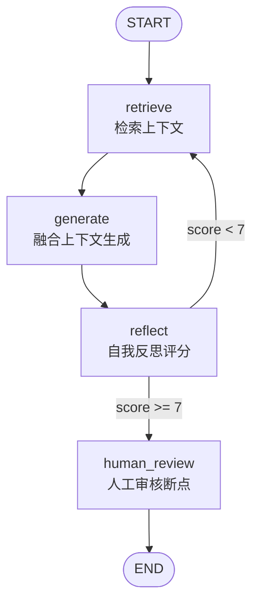

# LangGraph-RAG-Reflection 项目功能说明（提示词结构）

## 1. 整体概述

- 目标：构建一个具备检索增强与自我反思能力的智能体，支持人工审核断点与会话记忆。
- 技术栈：LangGraph（编排与状态机）、LangChain（LLM/工具/检索）、GLM-4（对话模型，经由 ChatOpenAI 配置 ZHIPU baseURL）、文件检索（文本分块+关键词计数）。
- 运行模式：
  - 交互式高级 Agent：自定义图（StateGraph）含检索、生成、反思、人工审核断点，入口：[run_advanced.ts](file:///Users/jansonrob/ai-code/agent-transactions/ts-advanced-agent/src/run_advanced.ts)。
- 关键组件：
  - 图与节点：[graph.ts](file:///Users/jansonrob/ai-code/agent-transactions/ts-advanced-agent/src/graph.ts)。
  - 状态结构：[state.ts](file:///Users/jansonrob/ai-code/agent-transactions/ts-advanced-agent/src/state.ts)。
  - 检索器与计算器示例：[retriever.ts](file:///Users/jansonrob/ai-code/agent-transactions/ts-advanced-agent/src/tools/retriever.ts)、[calculator.ts](file:///Users/jansonrob/ai-code/agent-transactions/ts-advanced-agent/src/tools/calculator.ts)。
  - 知识库：src/knowledge_base.txt（运行时按文本分块检索）。
- 配置与密钥：.env 提供运行所需的环境变量（请勿在文档或日志中暴露密钥）。

## 2. 功能清单

- 检索增强回答：基于知识库文本与向量索引，为用户查询提供语义检索上下文。
- 对话生成：在完整消息历史基础上融合检索上下文生成答案。
- 自我反思与评分：独立评估提示词，产出 Score 与 Critique，驱动控制流。
- 人工审核断点：在关键节点暂停以供人工批准或编辑后继续。
- 会话记忆与恢复：使用 MemorySaver 保持线程上下文，支持中断后恢复。
- 工具调用示例：基础 Agent 中演示工具（单词长度），高级示例包含计算器工具。

## 3. 详细描述（以 LangGraph 节点控制为例）

### 3.1 状态结构（AgentState）

- 字段：
  - messages：消息列表，使用 add 算子聚合（见 [state.ts](file:///Users/jansonrob/ai-code/agent-transactions/ts-advanced-agent/src/state.ts)）。
  - context：检索到的文档文本。
  - critique：反思评语。
  - score：质量评分（0-10）。
  - attempts：尝试计数（用于防止循环过深）。

### 3.2 节点定义与责任

- retrieve 节点（检索上下文）：从最新 HumanMessage 提取查询，调用检索器返回上下文（见 [graph.ts](file:///Users/jansonrob/ai-code/agent-transactions/ts-advanced-agent/src/graph.ts)）。
- generate 节点（融合生成）：构造系统提示词，将上下文前置后与历史消息共同传入 LLM（见 [graph.ts](file:///Users/jansonrob/ai-code/agent-transactions/ts-advanced-agent/src/graph.ts)）。
- reflect 节点（自我反思评分）：独立评估提示词，解析结果中的 Score 并回写状态（见 [graph.ts](file:///Users/jansonrob/ai-code/agent-transactions/ts-advanced-agent/src/graph.ts)）。
- human_review 节点（人工断点）：执行到此前中断，等待外部批准或人工编辑（见 [graph.ts](file:///Users/jansonrob/ai-code/agent-transactions/ts-advanced-agent/src/graph.ts)）。

### 3.3 边与条件控制

- 固定边：
  - START → retrieve → generate → reflect。
- 条件边：
  - reflect → human_review 或 retrieve（依据 score 与 attempts，判定逻辑见 shouldContinue：score ≥ 7 或 attempts ≥ 3 进入 human_review）。
- 结束边：
  - human_review → END。
- 记忆/中断：
  - MemorySaver 与 interruptBefore=["human_review"]。

### 3.4 图文结合（流程图）

说明：

- 从 START 进入检索，生成回答后进行反思评分。
- 评分达到阈值进入人工审核断点（可批准或编辑），否则回到检索以尝试改进（示例中为安全起见可能直接进入审核）。
- 通过 MemorySaver 保持线程态，支持中断恢复。

### 3.5 节点输入输出（提示词视角）

- retrieve
  - 输入：最新 HumanMessage.content（用户查询）。
  - 输出：context（多段文本拼接）。
- generate
  - 输入：messages（历史对话）、context。
  - 系统提示词示例：在回答中必须引用 context，若无则明确不知道。
  - 输出：messages 追加模型回复。
- reflect
  - 输入：last_message.content、context。
  - 系统提示词示例：严格评分员格式为“Score: 0-10\nCritique: 文本”。
  - 输出：critique、score、attempts（用于条件分支与循环限制）。
- human_review
  - 输入：当前状态；外部事件决定批准或编辑。
  - 输出：继续执行到 END 或状态被人工修正后继续。

### 3.6 运行与交互

- 高级 Agent（人工审核）：
  - 入口：[run_advanced.ts](file:///Users/jansonrob/ai-code/agent-transactions/ts-advanced-agent/src/run_advanced.ts)。
  - 交互要点：流式打印节点完成事件，在 human_review 处展示 AI 回答与评分，并询问批准/编辑（运行逻辑见 [run_advanced.ts](file:///Users/jansonrob/ai-code/agent-transactions/ts-advanced-agent/src/run_advanced.ts)）。

## 4. 面向 AI 的提示词结构（同时人类可读）

### 系统角色

- 你是具备检索增强与反思能力的协作式智能体，遵循节点控制流并尊重上下文。

### 目标

- 回答用户问题，同时引用检索上下文；在不确定时明确“未知”；通过反思评分驱动控制流，并允许人工审核。

### 约束

- 不泄露密钥与隐私；仅以检索到的 context 与历史 messages 为依据；评分格式必须严格遵循。

### 可用工具

- 检索器：基于文件的简单检索（文本分块+关键词计数，见 [retriever.ts](file:///Users/jansonrob/ai-code/agent-transactions/ts-advanced-agent/src/tools/retriever.ts)）。
- 计算器：表达式求值示例（仅示例用途，生产需替换为安全库，见 [calculator.ts](file:///Users/jansonrob/ai-code/agent-transactions/ts-advanced-agent/src/tools/calculator.ts)）。

### 状态与输入

- 输入：最新用户消息（HumanMessage）。
- 状态：messages、context、critique、score。

### 过程步骤（节点级）

1. retrieve：从最新用户消息提取查询并检索上下文。
2. generate：将上下文与消息历史进行融合生成回答。
3. reflect：基于上下文独立评分并产出批注。
4. 条件分支：score >= 阈值进入 human_review，否则根据策略回到 retrieve 或直接审核。
5. human_review：人工批准或编辑后继续到 END。

### 评价标准

- 相关性：回答必须引用上下文且与查询紧密关联。
- 准确性：事实不确定时明确“未知”；避免幻觉。
- 一致性：评分格式与输出结构一致。
- 可复现性：节点日志清晰、可追踪。

### 输出格式

- 最终回答：自然语言文本。
- 反思结果：固定格式“Score: N\nCritique: 文本”。
- 审核记录：批准/编辑说明（外部交互）。

## 5. 配置与安全

- 环境变量：.env；请在运行环境中设置所需密钥与参数，切勿在代码库或文档中明文暴露。当前 LLM 使用 ZHIPUAI_API_KEY，并通过 ChatOpenAI 的 configuration.baseURL 指向大模型服务。
- 知识库维护：src/knowledge_base.txt；更新内容后无需重建索引，检索器会按最新文本进行分块与匹配。
- 安全建议：计算器示例使用 eval，仅限教学场景；生产环境应替换为安全的数学解析库。

## 6. 扩展建议

- 评分驱动的自适应检索：低分时改写查询或切换检索策略。
- 人工审核工作台：更丰富的编辑/注释界面与审计日志。
- 多模态拓展：支持图像/表格检索与回答。
- 评估指标：引入 BLEU/ROUGE 或基于 Groundedness 的指标。
